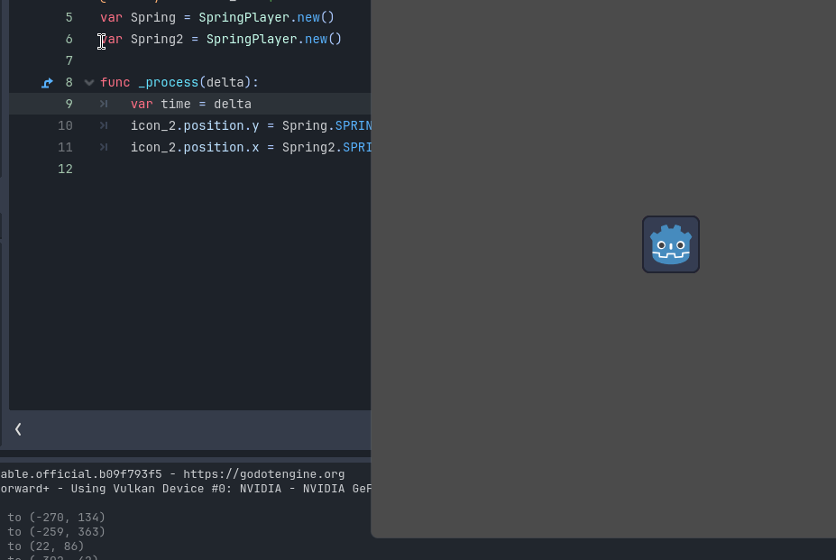

##**Overview**##
!
Yes, you can easly implement spring in your game, and is lightweight.

**Installation:**

Just copy the code from Springplayer.gd to a new script in .gd

**Instructions:**

after you cloning the springplayer code, go in your script, and make a variable.

	var Spring = SpringPlayer.new()

and make something like this,

	func _process(delta):

	var time = delta
 
	yournodeA.position.y = Spring.SPRINGCALL(time,yournodeA.position.y ,yournodeB.position.y )

and is that!

**know issues:**
you need to make every spring unique! new instance for every value.
!

any suggestion is welcome! have a good coding!
